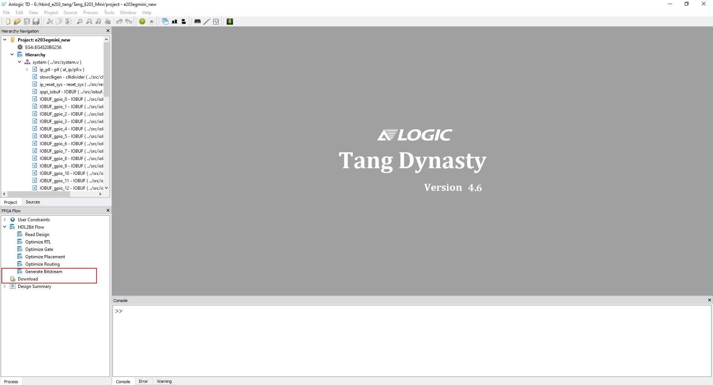

# Hbird E203 + RT-Thread on Lichee Tang (EG4S20)

```
 \ | /
- RT -     Thread Operating System
 / | \     3.1.3 build Nov 25 2020
 2006 - 2019 Copyright by rt-thread team
Hello RT-Thread!
msh >
```

This repo aims to run RT-Thread (RTOS) on HBird E203 (蜂鸟 E203) soft core (荔枝糖 EG4S20 FPGA).

[HBird E203](https://github.com/SI-RISCV/e200_opensource) is an open source RISC-V CPU core, and [RT-Thread](https://github.com/RT-Thread/rt-thread) is a burgeoning Real-Time Operating System (RTOS) in China that is small, stable and fast.


### Step 0 - Clone and initialize git submodules

This repo consists of two sub-repos. One is the FPGA soft core (HBird E203), and the other is the firmware (RT-Thread).

```
$ git clone https://github.com/wuhanstudio/hbird_e203_tang
$ cd hbird_e203_tang
$ git submodule init
$ git submodule update
```

### Step 1 - Upload FPGA bitstream

The IDE can be downloaded [here](http://dl.sipeed.com/), and instructions on how to install it can be found [here](https://tang.sipeed.com/en/getting-started/installing-td-ide/linux/).

Click on **Generate Bitstream**, then choose **download** to flash the bitstream to your board. 



Now FPGA is now a RISC-V development board.

### Step 2 - Build and compile rt-thread firmware

Connect your board with JTAG. here's the pin map.


Let's build the firmware. Instructions on how to set up the toolchain can be found [here](https://doc.nucleisys.com/hbirdv2/quick_start/sdk.html)

```
$ cd hbird-sdk/application/rtthread/msh/
$ export NUCLEI_TOOL_ROOT=/opt/nuclei/             # replace with your path
$ export PATH=$NUCLEI_TOOL_ROOT/gcc/bin:$NUCLEI_TOOL_ROOT/openocd/bin:$PATH
$ make SOC=hbird BOARD=hbird_eval CORE=e203 upload
```

That's it ! Congratulations !

### Related Projects

- [Picorv32 + RT-Thread](https://github.com/wuhanstudio/picorv32_tang)
