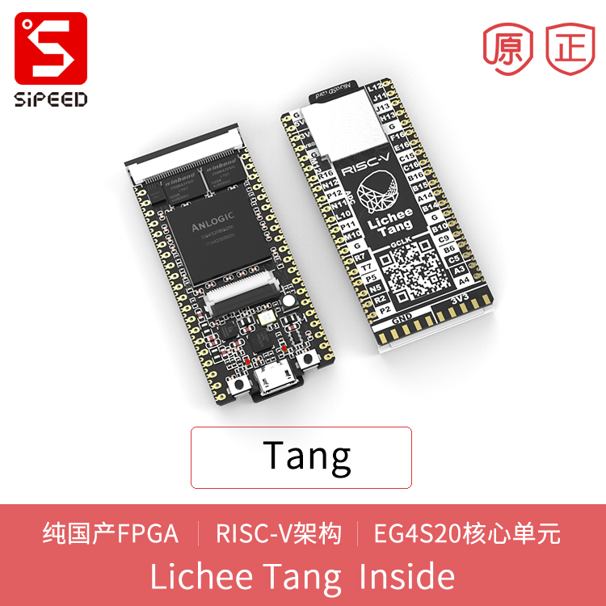
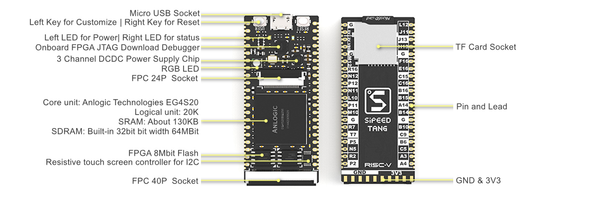
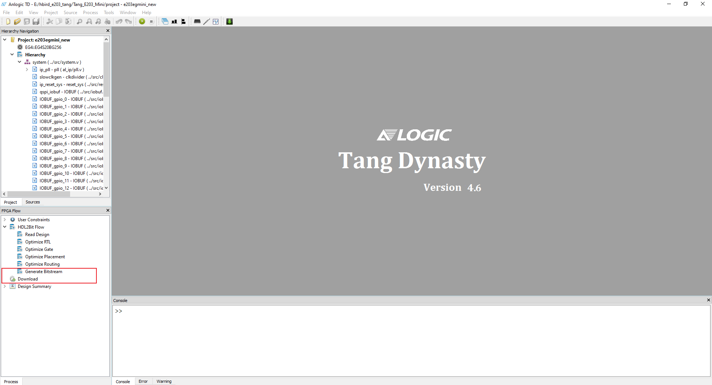
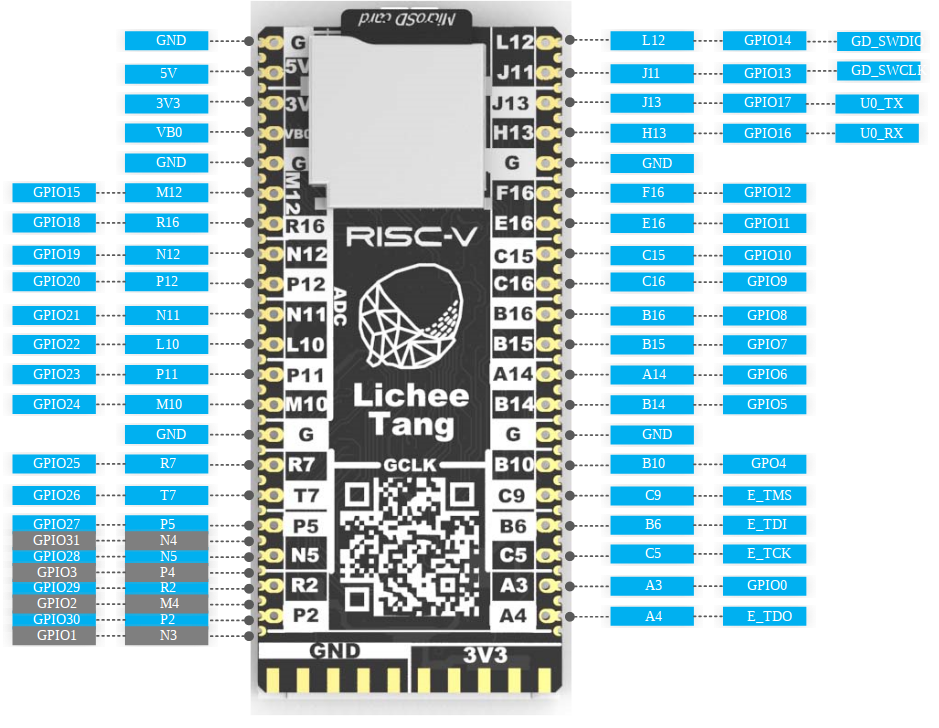

# Hbird E203 + RT-Thread on Lichee Tang (EG4S20)

```
 \ | /
- RT -     Thread Operating System
 / | \     3.1.3 build Nov 25 2020
 2006 - 2019 Copyright by rt-thread team
Hello RT-Thread!
msh >
```

This repo aims to run RT-Thread (RTOS) on HBird E203 (蜂鸟 E203) soft core (荔枝糖 EG4S20 FPGA).

[HBird E203](https://github.com/SI-RISCV/e200_opensource) is an open source RISC-V CPU core, and [RT-Thread](https://github.com/RT-Thread/rt-thread) is a burgeoning Real-Time Operating System (RTOS) in China that is small, stable and fast.





### Step 0 - Clone and initialize git submodules

This repo consists of two sub-repos. One is the FPGA soft core (HBird E203), and the other is the firmware (RT-Thread).

```
$ git clone https://github.com/wuhanstudio/hbird_e203_tang
$ cd hbird_e203_tang
$ git submodule init
$ git submodule update
```

### Step 1 - Upload FPGA bitstream

The IDE can be downloaded [here](http://dl.sipeed.com/), and instructions on how to install it can be found [here](https://tang.sipeed.com/en/getting-started/installing-td-ide/linux/).

Click on **Generate Bitstream**, then choose **download** to flash the bitstream to your board. 



Now FPGA is now a RISC-V development board.

### Step 2 - Build and compile rt-thread firmware

Connect your board with JTAG. here's the pin map.



Let's build the firmware. Instructions on how to set up the toolchain can be found [here](https://doc.nucleisys.com/hbirdv2/quick_start/sdk.html)

```
$ wget https://download.nucleisys.com/upload/files/toolchain/openocd/nuclei-openocd-2022.08-linux-x64.tgz
$ sudo tar -xvf nuclei-openocd-2022.08-linux-x64.tgz -C /opt

$ wget https://download.nucleisys.com/upload/files/toolchain/gcc/nuclei_riscv_newlibc_prebuilt_linux64_2022.08.tar.bz2
$ sudo tar -xvf nuclei_riscv_newlibc_prebuilt_linux64_2022.08.tar.bz2 -C /opt/Nuclei

$ sudo ln -s /usr/lib/x86_64-linux-gnu/libtinfo.so.6 /usr/lib/x86_64-linux-gnu/libtinfo.so.5
$ sudo ln -s /usr/lib/x86_64-linux-gnu/libncursesw.so.6 /usr/lib/x86_64-linux-gnu/libncursesw.so.5
```

```
$ cd hbird-sdk/application/rtthread/msh/
$ export NUCLEI_TOOL_ROOT=/opt/Nuclei/             # replace with your path
$ export PATH=$NUCLEI_TOOL_ROOT/gcc/bin:$NUCLEI_TOOL_ROOT/openocd/bin:$PATH
$ make SOC=hbird BOARD=hbird_eval CORE=e203 upload
```

### Step 3 - Upload rt-thread firmware

If OpenOCD does not work, you will need to use `flashrom` to manually upload the firmware to the user SPI flash (not the one that stores bitstream).

Since the user SPI flash pnis are not exposed, please refer to [lichee-tang-spi-passthrough](https://github.com/wuhanstudio/lichee-tang-spi-passthrough) to redirect SPI pins:

```
$ dd if=msh.bin of=msh_padded.bin bs=1M count=1 conv=sync
$ flashrom -p serprog:dev=COM3 -w .\msh_padded.bin
```

```
        ┌────────────────────┐
        │   STM32 (serprog)  │
        │                    │
        │ PA5  (SCK)  ───────┼──────────────┐
        │ PA4  (CS)   ───────┼──────────┐   │
        │ PA7  (MOSI) ───────┼──────┐   │   │
        │ PA6  (MISO) ◄──────┼──┐   │   │   │
        └────────────────────┘  │   │   │   │
                                │   │   │   │
                               B15 A14 B14  B16
                        ┌────────────────────────┐
                        │         FPGA           │
                        │                        │
                        │ B16  stm32_sck_in      │
                        │ B14  stm32_cs_in       │
                        │ A14  stm32_mosi_in     │
                        │ B15  stm32_miso_out    │
                        │                        │
                        │ H4   flash_sck_out ─────────────────┐
                        │ D3   flash_cs_out  ────────────┐    │
                        │ B3   flash_mosi_out ────────┐  │    │
                        │ F4   flash_miso_in  ─────┐  │  │    │
                        └────────────────────────┘ │  │  │    │
                                                   │  │  │    │
                                                   ▼  ▼  ▼    ▼
                                           ┌────────────────────┐
                                           │     SPI Flash      │
                                           │                    │
                                           │ CLK  ◄──────── H4  │
                                           │ CS   ◄──────── D3  │
                                           │ DI   ◄──────── B3  │ (MOSI)
                                           │ DO   ─────────► F4 │ (MISO)
                                           └────────────────────┘
```

That's it ! Congratulations !

### Related Projects

- [Picorv32 on MXO2 (Baremetal)](https://github.com/wuhanstudio/picorv32_MXO2)
- [Picorv32 on Lichee Tang (RT-Thread)](https://github.com/wuhanstudio/picorv32_tang)
- [HBird_E203 on Lichee Tang (RT-Thread)](https://github.com/wuhanstudio/hbird_e203_tang)
